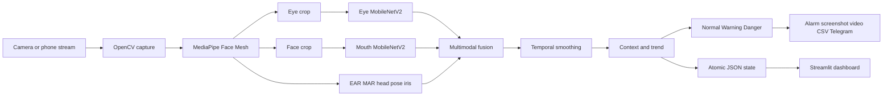

# DriveGuard: Full Project Review

**Project type:** Deep learning and computer vision prototype  
**Purpose:** Real-time multimodal driver drowsiness detection  
**Review date:** June 11, 2026  
**Main technologies:** Python, TensorFlow/Keras, MobileNetV2, MediaPipe, OpenCV, Streamlit, SVG/CSS

## 1. Executive summary

DriveGuard is a real-time driver-vigilance prototype. It observes the driver's face through a webcam or phone camera and estimates fatigue from three complementary sources:

1. Eye state.
2. Mouth and yawning state.
3. Head posture.

The project combines two MobileNetV2 binary classifiers with MediaPipe facial landmarks. Neural predictions are fused with geometric measurements, calibrated to the current driver, smoothed over time, and converted into three safety states: `NORMAL`, `WARNING`, and `DANGER`.

When a danger state is sustained, the system can play an alarm, save a screenshot, record an incident video, write a CSV event log, update a Streamlit dashboard, and optionally send a Telegram notification.

This is a strong academic prototype because it goes beyond a simple image classifier. It includes a complete operational pipeline from training to real-time inference, decision logic, user interface, evidence recording, and monitoring. It is not a certified automotive safety system and should not be presented as one.

## 2. Problem and objectives

Driver drowsiness is not represented by one signal only. A driver may close the eyes, yawn, lower the head, or progressively show several weak indicators. The project therefore uses multimodal fusion instead of relying on a single threshold.

The main objectives are:

- Detect sleepy or closed-eye appearance.
- Detect yawning or open-mouth appearance.
- Measure eye and mouth geometry from facial landmarks.
- Estimate abnormal head posture.
- adapt geometric thresholds to the current driver.
- Stabilize predictions across time and camera frame rates.
- Produce understandable warnings and evidence.
- Provide a professional real-time dashboard.
- Support an integrated webcam, virtual camera, or phone stream.

## 3. End-to-end architecture



The application has two principal processes:

- `main.py` performs camera capture, inference, scoring, alerting, recording, and state publication.
- `dashboard.py` provides a stable Streamlit shell and localhost state endpoint. `dashboard_live.html` reads that endpoint and updates its existing DOM without rerunning Streamlit.

This separation is simple and practical for a local demonstration.

## 4. Dataset and training stage

### 4.1 Eye-state dataset

The notebook uses the MRL Eye Dataset with three separate folders:

| Split | Images |
| --- | ---: |
| Training | 50,937 |
| Validation | 16,980 |
| Test | 16,981 |

The saved class mapping is:

```text
awake = 0
sleepy = 1
```

This mapping matches the real-time application, where a larger eye-model output represents greater drowsiness risk.

Eye-image augmentation includes rotation, zoom, horizontal flipping, and brightness variation. All images are resized to `64 x 64`, converted to RGB, and normalized to `[0, 1]`.

### 4.2 Eye model

The eye classifier uses ImageNet transfer learning:

- MobileNetV2 backbone without its original classification head.
- Last 40 backbone layers unfrozen for fine-tuning.
- Global average pooling.
- Batch normalization.
- Dense layer with 256 units and ReLU.
- Dropout of 0.4.
- Dense layer with 128 units and ReLU.
- Dropout of 0.3.
- One sigmoid output.

Exact artifact information:

| Property | Value |
| --- | ---: |
| Input | `64 x 64 x 3` |
| Output | One sigmoid probability |
| Layers | 161 |
| Total parameters | 2,624,065 |
| Trainable parameters | 2,045,057 |

Training uses Adam with a learning rate of `1e-4`, binary cross-entropy, accuracy, and AUC. Early stopping, learning-rate reduction, and best-model checkpointing are applied.

The notebook records the following results:

| Metric | Result |
| --- | ---: |
| Best validation accuracy | 98.78% |
| Best validation AUC | 99.87% |
| Test accuracy | 98.91% |
| Test AUC | 99.86% |

These are strong dataset results. Real-world performance can still be lower because webcam lighting, glasses, head angle, blur, and subject differences are not identical to the dataset.

### 4.3 Mouth/yawn dataset

The mouth model uses the Yawn Eye Dataset with the following recorded sizes:

| Split used in the original notebook | Images |
| --- | ---: |
| Training | 1,233 |
| Test/validation | 215 |

The class mapping is explicitly fixed:

```text
no_yawn = 0
yawn = 1
```

The improved `train_mouth_model_v2.py` adds stronger augmentation, balanced class weights, longer training, early stopping, learning-rate reduction, and checkpointing. It uses the full face because the chosen dataset is organized as face images rather than isolated mouth crops.

### 4.4 Mouth model

The current mouth artifact uses:

- MobileNetV2 with ImageNet weights.
- Last 40 backbone layers unfrozen.
- Global average pooling and batch normalization.
- Dense layers with 128 and 64 units.
- Dropout of 0.4 and 0.3.
- One sigmoid output.

Exact artifact information:

| Property | Value |
| --- | ---: |
| Input | `64 x 64 x 3` |
| Output | One sigmoid probability |
| Layers | 161 |
| Total parameters | 2,435,393 |
| Trainable parameters | 1,856,385 |

The original notebook records a best validation accuracy of 83.72% and a validation AUC reaching 91.08%. However, the same 215-image folder was used during training as validation data. It is therefore not an independent final test result.

The current v2 model architecture is present, but its final classification report and confusion matrix are not stored in the repository. The report should not claim a precise v2 test accuracy without rerunning evaluation on an untouched test split.

## 5. Real-time detection stage

### 5.1 Camera input

The detector supports:

- Integrated webcam by integer index.
- Virtual cameras such as DroidCam or OBS.
- Android IP Webcam by phone IP address.
- A generic HTTP video-stream URL.

Local cameras request MJPG, `640 x 480`, and 30 FPS. IP-camera buffering is reduced to limit visible latency.

### 5.2 Face landmarks

MediaPipe Face Mesh supplies landmarks for:

- Both eyes.
- Mouth contour.
- Nose and chin.
- Left and right iris.

The application calculates:

- Eye Aspect Ratio, or EAR.
- Mouth Aspect Ratio, or MAR.
- Approximate head roll and pitch.
- An iris-position attention heatmap.

The heatmap is correctly described as iris attention rather than calibrated gaze tracking.

### 5.3 Personal calibration

At the start of a session, the driver looks forward with eyes open and mouth closed. The default calibration period is 30 seconds, with a minimum of 5 seconds.

The system collects EAR and MAR samples, then derives personal thresholds from their distributions. This is better than applying one fixed face-geometry threshold to all people.

Calibration improves personalization but assumes that the driver starts the session alert and correctly positioned.

### 5.4 CNN inference

The eye classifier receives a crop containing both eyes. The mouth classifier receives a face crop. CNN inference runs in a background worker and is skipped on some frames to preserve real-time performance.

The current models use the following probability meanings:

- `eye_pred` near 1: sleepy eye appearance.
- `mouth_pred` near 1: yawn appearance.

### 5.5 Multimodal fusion

The application first combines CNN and geometric evidence:

```text
eye_risk   = 0.70 * eye_CNN   + 0.30 * EAR_risk
mouth_risk = 0.50 * mouth_CNN + 0.50 * MAR_risk
head_risk  = normalized roll and pitch risk
```

The three modalities are then fused:

```text
raw_fatigue = 0.50 * eye_risk
            + 0.30 * mouth_risk
            + 0.20 * head_risk
```

The eye signal receives the largest weight because prolonged eye closure is one of the most direct visual fatigue indicators. The mouth and head signals provide confirmation and reduce dependence on one model.

### 5.6 Temporal behavior

The raw score is averaged over a 1.5-second time window and passed through an exponential smoother. Event timing uses seconds rather than frame counts:

| Event | Rule |
| --- | --- |
| Blink | Eye close/open cycle between 0.08 and 0.80 seconds |
| Prolonged closure | EAR below threshold for at least 1.0 second |
| Yawn | MAR above threshold for at least 1.2 seconds |
| Confirmed danger | Danger score sustained for 1.5 seconds |
| Danger release | Safe state sustained for 1.0 second |

This time-based implementation behaves more consistently on an 8 FPS phone stream and a 30 FPS local webcam.

### 5.7 Trend and context

The detector keeps a 60-second trend sampled every 0.5 seconds. A rising trend during `WARNING` can produce a predictive pre-alert, with a 30-second cooldown to prevent notification spam.

The final score can also be multiplied by context:

- High-risk hours between 02:00 and 05:59.
- Driving longer than two hours.
- Driving longer than four hours.

The multiplier is limited to 3.0. These are heuristic safety rules, not learned probabilities.

### 5.8 Decision states

The final thresholds are:

| State | Fatigue score |
| --- | --- |
| `NORMAL` | Below 28% |
| `WARNING` | 28% to below 58% |
| `DANGER` | 58% or higher |

Only a calibrated, sustained danger state activates the main alarm. Hysteresis avoids rapid alarm flickering near the threshold.

## 6. Alert and evidence pipeline

When danger is confirmed, the system can:

1. Play or loop `alarm.wav`.
2. Save a danger screenshot.
3. Preserve approximately five seconds of buffered video before the event.
4. Record approximately five seconds after the event.
5. Save the incident as an AVI video.
6. Add the event to the dashboard history.
7. Save session alerts to a timestamped CSV file.
8. Send a Telegram message and image when credentials are provided.

The current `outputs` directory contains 73 generated artifacts:

| Type | Count |
| --- | ---: |
| Screenshots (`.jpg`) | 57 |
| Incident videos (`.avi`) | 10 |
| Session logs (`.csv`) | 5 |
| Live state (`.json`) | 1 |

These files demonstrate that the complete incident pipeline has been exercised, not only the user interface.

## 7. Dashboard and interface

The Streamlit dashboard displays:

- Current driver state and fatigue percentage.
- Live/offline freshness indicator.
- Drive time and effective frame rate.
- Yawn, prolonged-eye-closure, and alert counts.
- Fatigue gauge with warning and danger zones.
- Fatigue history timeline.
- Estimated eye, mouth, and head contribution.
- EAR, MAR, head roll, blink rate, CNN outputs, trend, and context risk.
- Calibration, camera, Telegram, and recording status.
- Recent safety events.

The visible page is created once and remains mounted. The browser then polls a localhost JSON endpoint and updates existing DOM nodes in place:

| Operation | Period |
| --- | ---: |
| State polling | 0.20 seconds |
| Text, gauge, bars, sensors, and current timeline point | Up to 0.20 seconds |
| Alert-list reconstruction | Only when the alert list changes |

Streamlit now acts only as a stable shell containing one iframe. It does not rerun the visible dashboard during monitoring. Lightweight JavaScript changes text and SVG attributes directly, while the detector writes JSON atomically through a temporary file and `os.replace`.

## 8. Main improvements completed

The project was reviewed and improved in the following areas:

### Real-time behavior

- Replaced all dashboard reruns and fragments with a fixed browser DOM and direct 200 ms JavaScript updates.
- Replaced the Plotly visualizations with lightweight SVG/CSS panels.
- Reduced IP-camera buffering.
- Added camera-specific frame skipping for CNN inference.
- Vectorized the iris heatmap instead of updating pixels through Python loops.
- Corrected pre-alert and post-alert video sampling.

### Detection reliability

- Replaced frame-count event rules with time-based rules.
- Added danger confirmation and release hysteresis.
- Added pre-alert cooldown.
- Corrected the trend buffer so it really represents 60 seconds.
- Reset event timers when the face disappears or calibration completes.
- Prevented danger alarms before calibration.

### Operational robustness

- Added personal calibration duration as a command-line option.
- Removed the hard-coded phone IP address.
- Added virtual-camera, phone, and generic URL input modes.
- Made audio initialization tolerant of machines without an audio device.
- Checked whether the video writer opens successfully.
- Added timestamped session CSV files instead of overwriting one log.
- Added atomic and throttled dashboard state updates.
- Delayed heavy imports so `main.py --help` starts quickly.

### Scientific clarity

- Removed misleading LSTM claims from the active prototype description.
- Renamed the gaze heatmap to iris-attention heatmap.
- Documented the real fusion and smoothing approach.
- Separated runtime and training dependencies.

### Project cleanup

- Removed the redundant standalone alarm generator because `main.py` can generate the WAV file itself.
- Removed unused imports and dead variables.
- Added a clean `.gitignore`.
- Added project and smartphone-camera documentation.

## 9. Project structure

| File or directory | Role |
| --- | --- |
| `main.py` | Complete real-time detector and OpenCV interface |
| `dashboard.py` | Stable Streamlit shell and localhost state server |
| `dashboard_live.html` | Fixed dashboard DOM with direct JavaScript updates |
| `deep-learning.ipynb` | Original Kaggle eye and mouth training notebook |
| `train_mouth_model_v2.py` | Improved mouth-model training pipeline |
| `models/eye_model.keras` | Trained eye-state classifier |
| `models/mouth_model.keras` | Trained yawn classifier |
| `alarm.wav` | Local danger alarm |
| `outputs/` | Runtime screenshots, videos, logs, and shared state |
| `requirements.txt` | Runtime dependencies |
| `requirements-training.txt` | Additional training dependencies |
| `SMARTPHONE_WEBCAM.md` | Phone-camera setup guide |
| `README.md` | Quick installation and usage documentation |

The `models` and `outputs` directories are ignored by Git. The model files must be added manually to the final submission ZIP or managed with Git LFS.

## 10. Installation and execution

### Install

```powershell
python -m venv venv
.\venv\Scripts\Activate.ps1
.\venv\Scripts\python.exe -m pip install -r requirements.txt
```

### Start the dashboard

```powershell
.\venv\Scripts\python.exe -m streamlit run dashboard.py
```

### Start with the integrated webcam

```powershell
.\venv\Scripts\python.exe main.py --source 0
```

### Start with a virtual phone camera

```powershell
.\venv\Scripts\python.exe main.py --source 1
```

### Start with Android IP Webcam

```powershell
.\venv\Scripts\python.exe main.py --source phone 192.168.1.42
```

### Faster rehearsal calibration

```powershell
.\venv\Scripts\python.exe main.py --source 0 --calibration-seconds 10
```

Use the default 30 seconds for the final technical evaluation when time permits.

## 11. Verification performed

The final project was checked with the following results:

- Python compilation passed for `main.py`, `dashboard.py`, and `train_mouth_model_v2.py`.
- `pip check` reported no broken dependencies.
- Both `.keras` models loaded successfully.
- The dashboard test rendered one stable iframe with zero exceptions.
- The local HTML and JSON endpoints responded successfully.
- The dashboard JavaScript passed a syntax check and a real Chrome screenshot test.
- The command-line help loaded correctly and quickly.
- Git's whitespace and patch-format check passed.
- The detector completed alarm and model initialization before correctly rejecting an intentionally invalid camera index.

The only expected warning during automated dashboard testing was Streamlit's missing script context in bare test mode.

## 12. Critical technical review

### Strong points

- The project solves a real safety-related problem with a complete demonstrable workflow.
- Multimodal fusion is more credible than a single eye threshold.
- Eye class mapping is verified and consistent with production inference.
- Personal calibration handles part of the variation between drivers.
- Time-based logic makes behavior less dependent on FPS.
- Hysteresis and cooldown reduce visible false-alarm instability.
- The dashboard is clear, professional, and operationally useful.
- Incident evidence makes the project easier to validate and present.
- The code supports several camera sources and a low-quality webcam workaround.
- The project description now distinguishes implemented features from future work.

### High-priority limitations

1. **Mouth evaluation is not fully independent.** The original and v2 training code uses the test directory as validation data for checkpoint selection. Create train, validation, and untouched test splits before claiming final test accuracy.
2. **The v2 mouth metrics are not archived.** Save `metrics.json`, the confusion matrix, classification report, class mapping, random seed, and training history with every trained model.
3. **No driver-level real-world benchmark is included.** Dataset accuracy alone does not measure full-system alert accuracy. Record labeled sessions from multiple people and report false alerts per hour, missed events, precision, recall, and detection delay.
4. **This is not a safety-certified system.** It should be presented as an academic assistance prototype, not as a replacement for driver responsibility or certified automotive monitoring.

### Medium-priority limitations

- Head pose is an approximation based on landmark geometry, not a calibrated `solvePnP` 3D pose.
- The mouth CNN receives a face crop; a dedicated mouth ROI or a temporal mouth model may generalize better.
- Calibration assumes an alert and cooperative driver at startup.
- Fixed fusion weights and thresholds were chosen heuristically rather than optimized on a labeled multimodal validation set.
- The context multiplier represents engineering rules, not a statistically calibrated probability.
- JSON file communication is appropriate locally but not ideal for remote or multi-user deployment.
- Telegram credentials passed on the command line can appear in process history; environment variables or Streamlit secrets would be safer.
- The application is mostly concentrated in one large `main.py`, which limits unit testing and maintenance.

### Low-priority limitations

- Some notebook text contains encoding artifacts from the Kaggle export.
- The eye and mouth training paths are Kaggle-specific.
- Model metadata is not embedded in a versioned manifest.
- There is no automated end-to-end camera test because physical camera availability differs by machine.

## 13. Recommended next improvements

### Priority 0: before submission

1. Include `models/eye_model.keras` and `models/mouth_model.keras` in the final ZIP.
2. Include one representative screenshot, incident video, and CSV log.
3. State clearly that temporal smoothing is implemented and CNN-LSTM is future work.
4. Present the eye metrics as recorded results and label mouth metrics as preliminary.
5. Test the complete demonstration once with the exact phone or camera used for the presentation.
6. Keep the laptop connected to power and close GPU/CPU-heavy applications.

### Priority 1: scientific quality

1. Split mouth data into train, validation, and untouched test sets.
2. Use subject-independent splits whenever subject identifiers are available.
3. Save and version all metrics and class mappings.
4. Evaluate the complete system, not only individual classifiers.
5. Report precision, recall, F1, ROC-AUC, confusion matrices, false alarms per hour, and alert latency.
6. Optimize fusion weights on labeled multimodal sessions.

### Priority 2: model quality

1. Train on additional datasets such as NTHU-DDD or UTA-RLDD when licensing permits.
2. Add infrared or low-light data augmentation.
3. Compare face-crop and mouth-ROI yawn classifiers.
4. Add a true temporal architecture such as CNN-LSTM, temporal convolution, or a small transformer.
5. Calibrate model probabilities with temperature scaling or Platt scaling.

### Priority 3: engineering quality

1. Split `main.py` into capture, landmarks, models, fusion, alerts, state, and UI modules.
2. Move thresholds and weights to a versioned YAML or JSON configuration file.
3. Add unit tests for EAR, MAR, temporal events, fusion, hysteresis, and state serialization.
4. Export optimized TensorFlow Lite models for better CPU performance.
5. Replace local JSON polling with WebSocket or a small API for remote deployment.
6. Store secrets in environment variables.

## 14. Honest assessment

| Area | Assessment |
| --- | --- |
| Problem relevance | Strong |
| Deep-learning implementation | Strong for an academic prototype |
| Real-time integration | Strong |
| Interface and visualization | Very strong |
| Reliability engineering | Good after the final improvements |
| Scientific validation | Strong for eyes, incomplete for mouth and full-system behavior |
| Reproducibility | Moderate |
| Production readiness | Prototype only |

Overall, DriveGuard is a convincing end-to-end deep-learning project. Its strongest contribution is the integration of learned and geometric signals into a usable real-time safety workflow. Its main remaining weakness is not the interface or runtime code; it is rigorous independent validation of the mouth model and the complete alert system.

## 15. Recommended presentation flow

### Slide 1: Problem

Explain the danger of driver fatigue and why a single visual signal is insufficient.

### Slide 2: Proposed solution

Present the three modalities: eyes, mouth, and head posture.

### Slide 3: Datasets and CNN models

Show MRL Eye and Yawn Eye datasets, MobileNetV2 transfer learning, input size, augmentation, and the verified eye results.

### Slide 4: Real-time pipeline

Show camera capture, MediaPipe, CNN inference, geometric measurements, fusion, temporal smoothing, and decision states.

### Slide 5: Reliability logic

Explain calibration, sustained danger, hysteresis, trend pre-alert, and time-based event detection.

### Slide 6: Dashboard

Show the fatigue gauge, timeline, sensor values, modality contributions, and alert history.

### Slide 7: Demonstration

1. Start the dashboard.
2. Start the detector.
3. Complete calibration.
4. Show normal behavior.
5. Demonstrate a yawn and prolonged eye closure.
6. Show the generated screenshot, video, and CSV.

### Slide 8: Limits and perspectives

State the current limitations honestly, then present independent validation, true temporal models, additional datasets, and embedded deployment as future work.

## 16. Short oral summary

> DriveGuard is a real-time multimodal driver-drowsiness detection prototype. We trained two MobileNetV2 classifiers for sleepy eyes and yawning, then combined their outputs with MediaPipe-based EAR, MAR, and head-pose measurements. A personal calibration stage adapts the geometric thresholds to the driver. The multimodal score is smoothed over time and classified into normal, warning, and danger states. Sustained danger activates an alarm and saves a screenshot, incident video, CSV event log, and optional Telegram notification. A Streamlit dashboard displays the live score, trend, sensor values, modality contributions, and event history. The current system uses temporal smoothing rather than a true LSTM, which is one of our proposed future improvements.

## 17. Likely jury questions

### Why use both CNN and EAR/MAR?

CNNs learn visual appearance, while EAR and MAR provide interpretable geometry. Their fusion reduces dependence on one imperfect signal.

### Why MobileNetV2?

It offers a good speed-to-accuracy ratio for real-time CPU inference and supports transfer learning from ImageNet.

### Why calibrate each driver?

Natural eye opening and mouth geometry differ between people and camera angles. Personal calibration makes geometric thresholds more appropriate.

### Is this a CNN-LSTM system?

No. The implemented prototype uses CNN classifiers and explicit temporal smoothing. A CNN-LSTM is a future extension and should not be claimed as an existing component.

### Why can the system still produce false alarms?

Lighting, glasses, blur, face occlusion, camera angle, unusual facial expressions, and dataset-domain differences can affect the visual signals.

### What is the main scientific improvement still needed?

An untouched mouth test set and a labeled multi-driver, real-world evaluation of the full alert pipeline.

### Can it work with a phone?

Yes. It supports virtual phone cameras and Android IP Webcam streams. Network quality affects latency and FPS.

## 18. Final conclusion

The project now has a coherent story from data to decision:

```text
datasets -> transfer learning -> real-time landmarks and CNN inference
-> multimodal fusion -> temporal decision -> alerts and evidence
-> live dashboard and incident history
```

The implementation is complete enough for a strong demonstration and academic submission. The report should emphasize the complete system integration, the verified eye-model results, the real-time improvements, and the professional dashboard. It should also be precise about the remaining mouth-validation limitation and the absence of a true LSTM.
